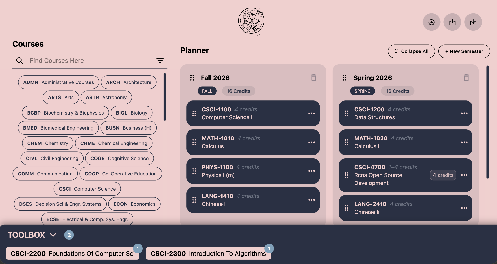

<p align="center">
  
</p>

<div align="center">
<h1>CARPI Course Planner - Frontend</h1>
  <a href="http://carpi.cs.rpi.edu/">
    
  </a>
  <a href="https://opensource.org/license/mit">
    
  </a>
  <a href="https://discord.com/invite/xRBvFHgcYT">
    
  </a>
  <h4>Built for RPI Students</h4>

The CARPI Course Planner allows you to plan future semesters with ease. Complete with a course catalog for quickly finding historical and current courses, a toolbox for holding your desired courses, and a planner to organize courses into your long-term plan.



</div>

## Features

- Responsive desktop + mobile experience
- Explore the RPI course catalog with search and filters
- Filter courses by subject, attributes, and semester availability
- Drag and drop courses into semester blocks
- Add, edit, and remove semester blocks
- Manage credit selection per course
- Persistent planner data in browser local storage
- Import and export planner data as JSON

## Getting Started

These instructions will help you get a copy of the project's frontend up and running on your local machine for development and testing.

### Prerequisites

To run this project, you need **Node.js** and **npm** installed on your machine. We currently pin tool versions in the `package.json` engines field:

- **Node.js**: `~24.14.0`
- **npm**: `~11.12.0`

We highly recommend using [Node Version Manager (nvm)](https://github.com/nvm-sh/nvm) to easily switch between Node versions. Verify your environment with:

```bash
node -v
npm -v
```

### Installation

1. Clone the repository and navigate into the project directory:

```bash
git clone https://github.com/Project-CARPI/site.git
cd site
```

2. Use the correct Node version. If you have `nvm` installed, simply run the following command to read the `.nvmrc` file and use Node v24.14:

```bash
nvm use
```

3. Install the dependencies and start the development server:

```bash
npm install
npm run dev
```

By default, Vite serves the app on localhost (usually `http://localhost:5173`).

To expose the app on your local network:

```bash
npm run dev -- --host
```

### Available Scripts

- `npm run dev`: Start the Vite development server.
- `npm run build`: Type-check and create a production build.
- `npm run preview`: Preview the production build locally.
- `npm run lint`: Run ESLint to check for code issues.
- `npm run prettier:check`: Check code formatting.
- `npm run prettier:write`: Auto-format files with Prettier.

## Backend Integration

The frontend uses Axios, which is configured in `src/lib/axios.ts` with the following base URL:

- `http://carpi.cs.rpi.edu:8000/api/v1/`

If you are running a local backend ([source code located here](https://github.com/Project-CARPI/api)), update the Axios `baseURL` in `src/lib/axios.ts` to point to your local server.

## Project Structure

```text
src/
  components/          # Shared UI components
  core/workspace/      # Planner workspace context, reducers, and persistence utils
  features/
    catalog/           # Catalog search, filters, and result rendering
    dnd/               # Drag-and-drop wiring
    planner/           # Planner UI and semester/course interactions
    toolbox/           # Global toolbox controls
  lib/                 # Shared helpers, API client, types, hooks, stores
  pages/               # Route-level pages (Home, Catalog, Planner)
```

## Build and Deployment

When you are ready to deploy the site to production, run the build command. This compiles the TypeScript files and bundles the project using Vite:

```bash
npm run build
```

The optimized, production-ready files are generated in the `dist/` folder. You can locally preview the production build by running:

```bash
npm run preview
```

## Built With

- [React 18](https://react.dev/) + [TypeScript](https://www.typescriptlang.org/)
- [Vite 6](https://vitejs.dev/)
- [Tailwind CSS 4](https://tailwindcss.com/)
- [ESLint](https://eslint.org/) + [Prettier](https://prettier.io/)
- [Radix UI](https://www.radix-ui.com/)
- [Zustand](https://zustand-demo.pmnd.rs/)
- [@dnd-kit](https://dndkit.com/)
- [Framer Motion](https://www.framer.com/motion/)
- [Zod](https://zod.dev/)

## Contributing

Please reach out to one of the current developers for information on how to get started with contributing to the project.

## Authors

<a href="https://github.com/Project-CARPI/site/graphs/contributors">
  
</a>

## License

This project is licensed under the MIT License. See [LICENSE](LICENSE) for details.
